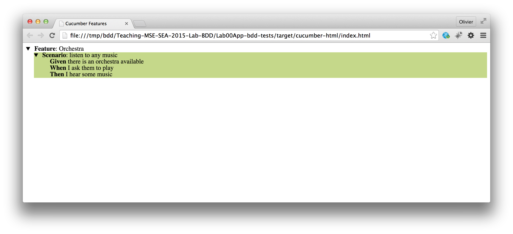
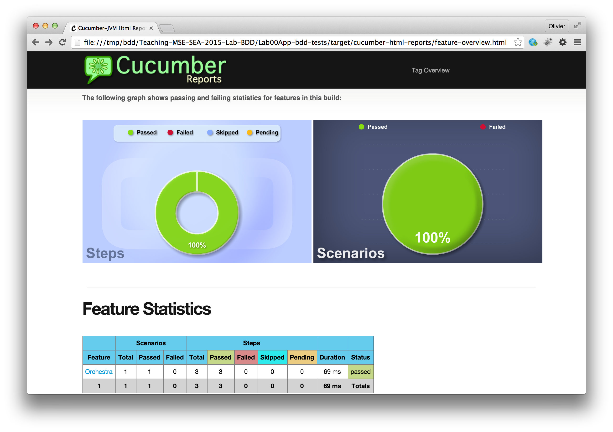
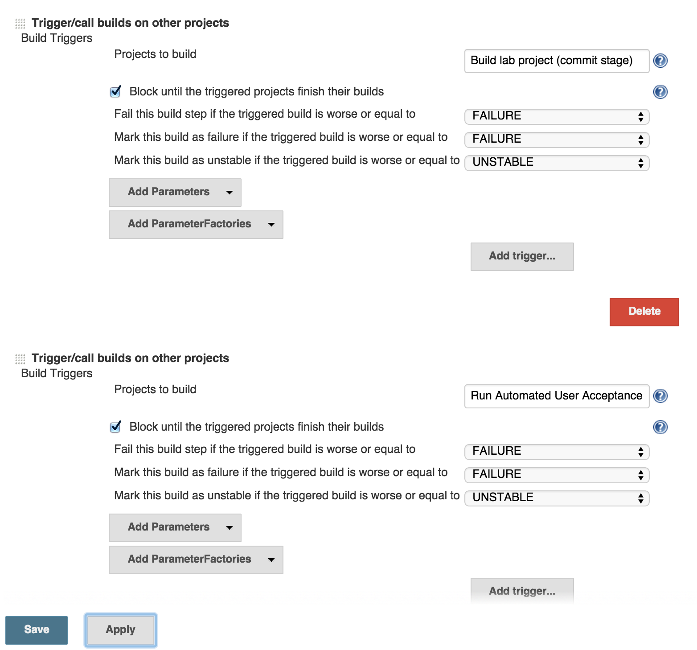
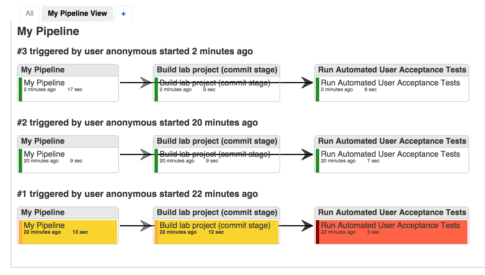

### Introduction

#### Part 1: The commit stage: build and run unit tests with maven
* **Task 1** : Register on services and get your IDs (10')
* **Task 2** : Setup the environment (30')
* **Task 3** : Fork this GitHub repo (10')
* **Task 4** : Understand the project structure (10')
* **Task 5** : Develop the Java code according to the executable specification (20')
* **Task 6** : Submit your results (10')

#### Part 2: Control the pipeline: trigger and monitor the build process with jenkins
* **Task 1** : Download and install jenkins (20')
* **Task 2** : Configure jenkins to get source code from GitHub and invoke maven (30')

#### Part 3: The automated user acceptance stage: BDD with Cucumber
* **Task 1** : Checkout ``with-bdd`` branch and run acceptance tests
* **Task 2** : Write a new scenario and supporting "glue" code (aka fixtures, aka steps)
* **Task 3** : Update jenkins configuration to launch BDD tests upon successful commit phase
* **Task 4** : Checkout ``with-bdd-web`` branch and run web tests
* **Task 5** : Write a new scenarios


-----

### Webcasts

There are 3 webcasts that describe the **part 1** of this lab:

* [One](https://www.youtube.com/watch?v=uqIva5-mKMs&index=1&list=PLfKkysTy70Qb_mfkkqa5OUMqsOPNEYZIa) that explains the difference between fork and clone on GitHub
* [One](https://www.youtube.com/watch?v=8LFbasLgM-M&index=2&list=PLfKkysTy70Qb_mfkkqa5OUMqsOPNEYZIa) that shows how to use maven from the command line to build and test the project.
* [One](https://www.youtube.com/watch?v=P3aMCCuAFv0&index=3&list=PLfKkysTy70Qb_mfkkqa5OUMqsOPNEYZIa) that shows how to build and test from NetBeans

There are 5 webcasts that describe the **part 2** of this lab:

* [One](https://www.youtube.com/watch?v=Q-1bvb9IfY0) that shows how to run Jenkins from the command line
* [One](https://www.youtube.com/watch?v=OKFj7Y0TB64) that shows how to install the Git plugin in Jenkins
* [One](https://www.youtube.com/watch?v=reHC3WoRRGg) that shows how to let jenkins know where you have installed maven on your system
* [One](https://www.youtube.com/watch?v=__djo4nlYbE) that shows how to configure maven and trigger a build manually (and see a failing unit test)
* [One](https://www.youtube.com/watch?v=btwxR2UnGro) that shows how to fix the failing test, push the fix to GitHub and trigger a successful build

-----

## Part 1: The commit stage: build and run unit tests with maven

### Task 1 : Register on GitHub

1. If you don't have a **GitHub** account yet, get one [here](https://github.com/).

-----

### Task 2 : Setup the environment

In this lab, we will start by installing some of the tools that we will be using during the semester. 

#### 2.1. Make sure that you have a JDK 1.8 installed

You should use Java 8. Depending on the platform, it can be a bit tricky to figure out which JDK is actually used when you run a Java application. When you build the same project in Netbeans or on the command line, it is possible that a different version of the JDK is actually used. Keep this in mind if you encounter issues (maven might complain).

For Mac OS users, [here](http://stackoverflow.com/questions/6588390/where-is-java-home-on-osx-yosemite-10-10-mavericks-10-9-mountain-lion-10) and [there](http://stackoverflow.com/questions/17824889/how-to-force-maven-3-1-to-use-right-version-of-java-on-mac-os-8-10), you will find useful information.

To **validate** your installation, you can do a `java -version` from the command line.


#### 2.2. Install apache maven


Apache maven is a software development tool that is extremely popular in the Java community. As a matter of fact, if you work in a professional environment or contribute to an open source project, there is *no way* that you will escape it.

While our goal is not to make you a maven expert in this course, we want you to get familiar with it. You will use maven to build, test and run your projects, so it is important that you have a high-level understanding of what it does.

If you have used Makefiles, ant scripts or Grunt.js, you are already familiar with the notion of **software build automation**. Simply stated, maven is used to write recipes for transforming source code into running software. It manages the entire build cycle, which includes tasks such as compilation, unit testing, integration testing, code quality checks, packaging and deployment.

We will not get into further details right now. Installing maven on your machine is easy. Just go [here](http://maven.apache.org/download.cgi#Installation) and follow the instructions. When you are done, make sure to update your system path so that you can invoke maven with the `mvn` command from a terminal, wherever your are. If you are using Windows, [this](http://crunchify.com/how-to-setupinstall-maven-classpath-variable-on-windows-7/) page might be helpful.

When you have installed maven, you should be able to type `mvn -v` on the command line and see the following output:

```
$ mvn -v
Apache Maven 3.1.0 (893ca28a1da9d5f51ac03827af98bb730128f9f2; 2013-06-28 04:15:32+0200)
Maven home: /Users/admin/tools/maven/apache-maven-3.1.0
Java version: 1.8.0_11, vendor: Oracle Corporation
Java home: /Library/Java/JavaVirtualMachines/jdk1.8.0_11.jdk/Contents/Home/jre
Default locale: en_US, platform encoding: UTF-8
OS name: "mac os x", version: "10.9.5", arch: "x86_64", family: "mac"
```


In your home directory, there is a hidden directory named `.m2`. It contains a file named `settings.xml`, which is used to configure various aspects of your maven installation. On both Unix and Windows systems, the path to the file should be as follows:

```
~/.m2/settings.xml
```

If you are unsure of the exact path to this file, type `mvn -X` on the command line to run maven in debug mode.
The command will produce an error because no goal was specified, but it will also output the path to the `settings.xml` file you are looking for.
Note the second `[DEBUG]` line which tells you where to find your user's `settings.xml` file:

```
$ mvn -X
Apache Maven 3.2.3 (33f8c3e1027c3ddde99d3cdebad2656a31e8fdf4; 2014-08-11T22:58:10+02:00)
Maven home: /opt/local/share/java/maven3
Java version: 1.8.0_25, vendor: Oracle Corporation
Java home: /Library/Java/JavaVirtualMachines/jdk1.8.0_25.jdk/Contents/Home/jre
Default locale: en_US, platform encoding: utf-8
OS name: "mac os x", version: "10.10.2", arch: "x86_64", family: "mac"
[INFO] Error stacktraces are turned on.
[DEBUG] Reading global settings from /opt/local/share/java/maven3/conf/settings.xml
[DEBUG] Reading user settings from /Users/your-user/.m2/settings.xml
[DEBUG] Using local repository at /Users/your-user/.m2/repository
[DEBUG] Using manager EnhancedLocalRepositoryManager with priority 10.0 for /Users/your-user/.m2/repository
[INFO] Scanning for projects...
[DEBUG] Extension realms for project org.apache.maven:standalone-pom:pom:1: (none)
[DEBUG] Looking up lifecyle mappings for packaging pom from ClassRealm[plexus.core, parent: null]
[INFO] ------------------------------------------------------------------------
[INFO] BUILD FAILURE
[INFO] ------------------------------------------------------------------------
[INFO] Total time: 0.097 s
[INFO] Finished at: 2015-02-20T10:33:16+01:00
[INFO] Final Memory: 5M/245M
[INFO] ------------------------------------------------------------------------
[ERROR] No goals have been specified for this build.
...
```

You have to edit this file and **add your GitHub login name** in a new `<profile></profile>` section.
If this is your first time installing or configuring maven, the file may not exist so you may have to create it yourself.
Have a look at the example below. Grab the text, replace `wasadigi` with **your GitHub login** and save the file.

```xml
<settings>
...
  <profiles>
    <profile>
      <id>schoolPulse</id>
      <activation>
        <activeByDefault>true</activeByDefault>
      </activation>
      <properties>
        <ch.heigvd.schoolpulse.userid>wasadigi</ch.heigvd.schoolpulse.userid>
      </properties>
    </profile>
...
  </profiles>
...
</settings>
```

#### 2.3. Install NetBeans


In this course, we will be writing a lot of code, mostly in Java. We use Netbeans to prepare the labs and samples. So, if you use Netbeans, your life will be easier. If you prefer to use another IDE, that should be fine for most of the labs (we will let you know otherwise). But we will not be able to provide individual support for all IDEs, so you have to be ready to investigate issues on your own.

#### 2.4. Install and get familiar with a *real* command line tool


From what we have seen over the last few years, many students are not familiar or **comfortable with a terminal and command line tools**. This is particularly true for students using Windows as their main operating system. Launching `cmd.exe` is not something very common, and once in the terminal, it is not very easy nor practical to get work done.

**If you are in this situation, then it is now time to get familiar with proper tools**. This will make you a lot more productive. It will save you time during labs (not only in this course). It will allow you to do things in a cleaner and more efficient way.

**You do not have to be a shell guru**. Even with a couple of commands, you will quickly see the benefits. **Please, please** take the time to learn how to use this crucial tool.

If you are on **Windows**, then you have several options, including PowerShell, Gygwin, Git Bash or Babun, which seems to be gaining traction. Some of the options are described [here](https://macyves.wordpress.com/2014/09/18/hipsterising-windows-cygwin-vs-babun-vs-git-bash-vs-powershell-the-onion-scale/). To be honest, I am *not* a Windows user, so it is difficult for me to make a recommendation and you will have to make your own experiments. But if you have not used any of these tools, take the time to pick one and learn how to use it. Otherwise, you will loose an awful lot of time and will not be able to do some of the labs (this year and next year). 

#### Check that you can do a tail

[Unix tail](http://en.wikipedia.org/wiki/Tail_%28Unix%29)

[PowerShell](https://technet.microsoft.com/en-us/library/hh849787.aspx)

[PowerShell -Tail](http://www.howtogeek.com/tips/how-to-get-tail-like-functionality-on-windows-with-powershell/)

#### Check that you can do a grep

[Unix grep](http://en.wikipedia.org/wiki/Grep)

[PowerShell](https://communary.wordpress.com/2014/11/10/grep-the-powershell-way/)

-----

### Step 3 : Fork the GitHub repo

Ok, now that your environment is setup, **time to get to the real work**. For the labs, we will be using a **collaborative development workflow**. You have to be familiar with git and the GitHub service. Here is a high-level description of the workflow:


1. We will create **one GitHub repo for every lab**. This repo will contain the instructions and a code skeleton. Often, we will provide a collection of JUnit tests that will allow us to **specify**, **validate** and **grade** your projects. If you try to run the JUnit tests at the beginning of the project, most of them should fail (they might not even compile). Reading the code of the tests will let you know what we expect from you (the tests are an **executable specification**).

2. You will **fork** the lab repo. Read this sentence again very carefully: we said **fork** and **not clone**. Forking the lab repo means that you will have your own copy of the lab repo hosted on GitHub, so that you can work independently. You will then **clone your fork** on your machine. Once again, what you are cloning is your fork, not the original repo. Got it?

3. You will then work on the assignment, write code do you tests. You should get used to commit your work on a regular basis (which means that you will have a local history). Before the submission date, you will then **push** your commits to your fork. You should also create a **pull request**, so that we know that you are done (and it's a way for us to provide feedback on the code).

4. *We know where you live*. After submission, we will check your forks. We have our own suite of automated tests, which we will use to evaluate your work.


-----

### Task : Understand the project structure

If you have followed the previous instructions, then you should now have a clone of your fork on your machine, in a directory named `Teaching-HEIGVD-RES-2015-Labo1`. Let's check what is inside:


If you look carefully, you will see that there are 3 files named `pom.xml` in the directory structure. These files are used by **maven** and you can think of them as 3 recipes for building our application. As indicated in the diagram, we actually have 3 projects. One with the application code, one with the automated tests and one on top of them. What we are going to do is build the top-level project. Maven will automatically compile the application code, compile the test code, run the tests and give us results. If all tests pass, then Maven will also produce a .jar file.


-----


### Task 5 : Develop the Java code according to the executable specification

Before opening Netbeans, let's build our software from the command line. To do that, we have to move into the top-level project, where the first `pom.xml` file is located and type the following command: `mvn clean install`. By doing that, we are asking maven to clean the workspace and to start the build process. You will see a long output on the console, starting with this:

```
$ cd Teaching-HEIGVD-RES-2015-Labo1/
$ ls
LICENSE		Lab00App-build	README.md
$ cd Lab00App-build/
$ ls
Lab00App-code	Lab00App-tests	pom.xml
$ mvn clean install
[INFO] Scanning for projects...
[INFO] ------------------------------------------------------------------------
[INFO] Reactor Build Order:
[INFO] 
[INFO] Lab00App-code
[INFO] Lab00App-tests
[INFO] Lab00App-build
[INFO]                                                                         
[INFO] ------------------------------------------------------------------------
[INFO] Building Lab00App-code 1.0-SNAPSHOT
[INFO] ------------------------------------------------------------------------
[INFO] 
...
```

If you go back in the terminal (and that is one first example that shows how important it is to have a proper command line tool!), you will notice the following section:

```
-------------------------------------------------------
 T E S T S
-------------------------------------------------------
Running ch.heigvd.res.lab00.ApplicationTest
Tests run: 5, Failures: 1, Errors: 0, Skipped: 0, Time elapsed: 0.002 sec <<< FAILURE! - in ch.heigvd.res.lab00.ApplicationTest
thereShouldBeAMethodToAddIntegers(ch.heigvd.res.lab00.ApplicationTest)  Time elapsed: 0 sec  <<< FAILURE!
java.lang.AssertionError: expected:<42> but was:<80>
	at org.junit.Assert.fail(Assert.java:88)
	at org.junit.Assert.failNotEquals(Assert.java:834)
	at org.junit.Assert.assertEquals(Assert.java:645)
	at org.junit.Assert.assertEquals(Assert.java:631)
	at ch.heigvd.res.lab00.ApplicationTest.thereShouldBeAMethodToAddIntegers(ApplicationTest.java:53)


Results :

Failed tests: 
  ApplicationTest.thereShouldBeAMethodToAddIntegers:53 expected:<42> but was:<80>

Tests run: 5, Failures: 1, Errors: 0, Skipped: 0
```

Very interesting: we see that 5 tests have been successfully run and that one has failed. We see that there seems to be a bug in the method that computes the sum between two integers... Indeed, if we look at the code, we see that the code of the `add(int a, int b)` method is wrong:

```java
$ cat Lab00App-code/src/main/java/ch/heigvd/res/lab00/Application.java 
package ch.heigvd.res.lab00;

/**
 * This is a very simple class used to demonstrate the specify-implement-validate
 * cycle. All methods used in the JUnit test are defined, so the test class will
 * compile. There is a bug in the add method, so one of the tests is expected
 * to fail.
 * 
 * If you look at the class named ch.heigvd.res.lab00.ApplicationTest, you will
 * find an executable specification for this class. The test methods specify
 * the expected behavior for this class.
 * 
 * @author Olivier Liechti
 */
public class Application {

  private String message;

  public Application() {
    this("HEIG-VD rocks!");
  }

  public Application(String message) {
    this.message = message;
  }

  public String getMessage() {
    return message;
  }

  public int add(int a, int b) {
    return a * b;
  }

}
```

After fixing the bug, we do another `mvn clean install` and this time, we see the following output:

```
-------------------------------------------------------
 T E S T S
-------------------------------------------------------
Running ch.heigvd.res.lab00.ApplicationTest
Tests run: 5, Failures: 0, Errors: 0, Skipped: 0, Time elapsed: 0.002 sec - in ch.heigvd.res.lab00.ApplicationTest

Results :

Tests run: 5, Failures: 0, Errors: 0, Skipped: 0
```

Sweet. Our implementation now is compliant with the executable specification. Well, that's because some unit tests have been commented out. Open the `TrumpetTest.java` file and uncomment the unit tests. Note that if you try to build the project now, it will fail. The reason is that the tests specify that you should have created interfaces and classes. You have not done that yet, and it is your assignment in this lab. 

If you read the name of the test methods, you will see that they are a way to specify the expected behavior of your application (that is why we speak of executable specification):

```
thereShouldBeAnIInstrumentInterfaceAndATrumpetClass
itShouldBePossibleToPlayAnInstrument
aTrumpetShouldMakePouet
aTrumpetShouldBeLouderThanAFlute
aTrumpetShouldBeGolden
```
To get all the details of the specification, you will have to take a close look at the body of the methods, such as this one. It should be pretty straightforward to determine what you have to implement in the `Lab00App-code` project (do **not** add the application classes in the `Lab00-App-tests` project!).

```java
  @Test
  public void aTrumpetShouldMakePouet() {
    IInstrument trumpet = new Trumpet();
    String sound = trumpet.play();
    Assert.assertEquals("pouet", sound);
  }
```

What we have done in the terminal can also be done directly in Netbeans:

- open the Lab00App-build project

- right-click on the Lab00App-build node in the Project tab and select *Open Required Project > Open All Projects*

- righ-click on the Lab00App-build node and select *Test*

You will see the following output in the IDE tabs. In the *Output* tab, you will see the same output that was generated when invoking maven on the command line. In the *Test Results* tab, you will see a user friendly visual representation of the test results. 

**After cloning the repo, you see 4 green tests and 1 red test. When you have finished the lab, you should see 10 green tests.**


### Task 6 : Submit your results

When you are done, you have to make sure that you push your changes to your fork hosted on GitHub. Indeed, to check your work, we will get the last version of your fork and run our test suite on your code.

Typically, what you will do is the following:

```bash
# We have modified several local files. We want to take a snapshot
# of files xxx.java and xx2.java and add it to the project history

git add xxx.java
git add xx2.java


# The staging area contains the 2 files. We can now create a local
# commit and provide a message

git commit -m "Implementation of xxx according to specification"


# Finally, we want to send the commit to the fork, so that it is visible
# for other users

git push origin master
```

Last but not least, we ask you to make a **pull request**. In a typical open source project, the following workflow is used by contributors:

1. The contributor wants to **make a contribution** (create a new feature, fix a bug, contribute to the documentation), so he **creates a fork**.
2. (*optional*) The contributor creates a **feature branch**.
3. The contributor **implements** a new feature or fixes a bug in his fork.
4. The contributor **does not have write access on the upstream server** (the original repo for the open source project)
5. For this reason, he **asks** the people who have the right to commit code on the upstream server to **pull** changes from the fork
6. On GitHub, this is not done by phone or email, but via the Web UI. On the fork home page, there is a "Pull Requests" menu. Clicking on the green button labeled *New pull request* initiates the process.
7. The committers review the submitted commits. They can add line-by-line comments, discuss with the contributor, etc. In the end, **they may accept or reject the pull request**.

In our workflow, we will most likely **not** accept your pull requests. However, having a pull request is a nice way to **notify us** that you are done with the implementation. It also give us a mechanism to give you **line-by-line feedback**.

----

-----

## Part 2: Control the pipeline: trigger and monitor the build process with jenkins

-----

### Task 1 : Download and install jenkins (20')

#### 1.1: Download jenkins

* Go to [http://http://jenkins-ci.org/](http://jenkins-ci.org/) and click on the download "Latest and greatest" link to download the .war file. [Here is the direct link](http://mirrors.jenkins-ci.org/war/latest/jenkins.war).

#### 1.2: Install and run jenkins

* Jenkins is a Java web application. You could deploy it in an application server (Tomcat, Glassfish, JBoss). As an alternative, Jenkins offers and embedded server, so you can run it directly with the following command:

```
java -jar jenkins.war
```

* If you look at the log produced by the command, you will see two interesting lines, which tell you where jenkins stores its configuration files and on which port it listens.

```
Jenkins home directory: /Users/admin/.jenkins found at: $user.home/.jenkins
mars 09, 2015 9:16:08 AM org.eclipse.jetty.util.log.JavaUtilLog info
INFO: Started SelectChannelConnector@0.0.0.0:8080
mars 09, 2015 9:16:08 AM winstone.Logger logInternal
```

* You should now be able to open a web browser and to log into jenkins by accessing the following url: [http://localhost:8080](http://localhost:8080).


-----

### Task 2 : Configure jenkins to get source code from GitHub and invoke maven (30')

* Now that jenkins is installed, we can create a build pipeline. This is done by creating one or more **jobs**. Click on the **New item** or **Create new job** links.

* When you are asked for a **job name**, you can specify **Build lab project (commit stage)**. You also have to select one project type: select **Maven project**.

* In the **Source Code Management**, you see that CVS and subversion are supported by default, but you cannot see git. You need to install a jenkins plugin for that. Click on the Jenkins icon (top-left) and click on **Manage jenkins**. Click on **Manage Plugins**, then on the **Available** tab. In the **filter** search box, type **git** and hit return. As you can see, there are many git and GitHub related plugins. Scroll to the bottom and select the one named **Git Plugin** (*This plugin allows use of Git as a build SCM*).

* When you start the installation process, you will notice that Jenkins automatically downloads the required dependencies (Credentials Plugin, Git Client Plugin, SCM API Plugin and finally Git Plugin). Make sure to **restart jenkins** where you are done. **Note that if the installation appears to be frozen, you may have to reload the page in the browser**.

* When you have installed the plugin, you can go back to your job. You do that by clicking on it in the main page and then selecting **Configure** in the left menu. As you can see, you have have the possibility to select **Git** in the Source Code Management section. Enter the **URL** of your GitHub fork, Add **Credentials** (and make sure to **select them** in the popup menu). You can use the default values for the rest of this section.

* In the **Build Triggers** section, unselect all options. We will trigger the builds manually for now.

* You may have to **configure maven**, which means that you have to tell jenkins where you have installed maven on your machine. Simply provide the **path** you have chosen on your local machine.

* In the **Build** section, you need to indicate where the **main pom.xml** file is located, relative to the root of your repo. Type in the following path: **./Lab00App-build/pom.xml**. In **Goals and options**, type **clean install**.

* You are all set! You can now try to build your project by clicking on the **green arrow** on the right side of your job (in the main jenkins page), or by clicking on the **Build now** element in the left menu (on the job configuration page). When you do that, you will see that the process is asynchronous: the build is put in a queue and waits for some workers to be available (this makes sense in real projects, especially with multiple developers).

* The color of the dot indicates whether the build was successful or not. If you click on the **Console Output**, you will have access to all the details (output of the maven build).


-----

## Part 3: The automated user acceptance stage: BDD with Cucumber

In this part of the lab, we show how to use one of the available BDD tools to write and run "automated user acceptance tests". 

We have decided to use [Cucumber](http://cukes.info), for two main reasons:

* Firstly, it is available on [a range of platforms](https://cukes.info/platforms) and is not restricted to the Java ecosystem (unlike JBehave for instance). In the tasks, we will consider 2 platforms: the JVM (running tests against a Java application) and Javascript (running tests against a web site). 

* Secondly (like JBehave), it uses the Gherkin language for writing features and scenarios in a "business language".

The setup of project can be a bit tricky (because some of the features are provided by third-party tools and because the documentation is sometimes a bit concise on some aspects). However, we have done the "plumbing" in advance and you will have a ready-to-go project as a starting point.


-----
### Task 1 : Checkout with-bdd branch and run acceptance tests

At the end of the previous phase, you should have reached a stage where you have added a couple of Java interfaces and classes, so that all unit tests pass. What we have done for this new phase of the lab is to create a feature branch called ``with-bdd``. 

You can checkout this branch, run the acceptance tests and check the results like so:

```
git checkout with-bdd
cd Lab00App-bdd-tests
mvn clean verify
```

You should observe the following output on the console (in the middle of other statements):

```
-------------------------------------------------------
 T E S T S
-------------------------------------------------------
Running ch.heigvd.res.lab00.RunCukesTest
Feature: Orchestra

  Scenario: listen to any music           # ch/heigvd/res/lab00/orchestra.feature:3
    Given there is an orchestra available # Steps.there_is_an_orchestra_available()
    When I ask them to play               # Steps.i_ask_them_to_play()
    Then I hear some music                # Steps.i_hear_some_music()

1 Scenarios (1 passed)
3 Steps (3 passed)
```

Sweet! That is the output of the **automated user acceptance tests**. As you can see, a scenario has been defined and executed. It is at the same time something that can be read and discussed with non-technical people (product owner, functional QA, etc) and something that can be automatically executed.

#### Check the reports

Open the `./target` directory and have a look at the available folders:

```
-rw-r--r--  1 admin  wheel  2005 16 mar 08:31 Lab00App-bdd-tests-1.0-SNAPSHOT.jar
drwxr-xr-x  7 admin  wheel   238 16 mar 08:31 cucumber-html
drwxr-xr-x  8 admin  wheel   272 16 mar 08:31 cucumber-html-reports
-rw-r--r--  1 admin  wheel  1422 16 mar 08:31 cucumber.json
drwxr-xr-x  3 admin  wheel   102 16 mar 08:30 generated-test-sources
drwxr-xr-x  3 admin  wheel   102 16 mar 08:31 maven-archiver
drwxr-xr-x  3 admin  wheel   102 16 mar 08:30 maven-status
drwxr-xr-x  4 admin  wheel   136 16 mar 08:31 surefire-reports
drwxr-xr-x  3 admin  wheel   102 16 mar 08:30 test-classes
```

Have a look at the `cucumber-html` and `cucumber-html-reports` folders, with a web browser. You will discover user-friendly html reports that give you a nice "executable specification report". The two folders are generated by different plugins (that is part of the "plumbing" that we talked about before).






#### Understand where are the different pieces of the puzzle

The BDD setup is made of the following pieces:

##### A. The feature and acceptance criteria

The features and acceptance criteria (written by or with business-oriented people) are written in Gherkin. They are located in `./Lab00App-bdd-tests/src//test/resources/ch/heigvd/res/lab00/`. 

Here is what it looks like:

```
Feature: Orchestra

  Scenario: listen to any music
    Given there is an orchestra available
    When I ask them to play
    Then I hear some music
```
As you can see, we don't write any code here, but we use special keywords: `Feature`, `Scenario`, `Given`, `When` and `Then`. This is what makes it possible to invoke "glue code" later on.

##### B. The glue code (fixtures)

The glue code is the code that will be invoked by Cucumber when the tool parses Gherkin files and finds scenarios. **The glue is responsible for making "calls" against the system that we want to test**. 

In this first example, we are testing a Java application (as a library). So, the glue code is Java code that will interact with Java objects (instances of classes implemented in the library). If we were testing a web app, then the glue code would control a web browser to issue HTTP requests against the web app. If we were testing a REST API, then the glue code would use an HTTP client library to issue HTTP requests.

It is also in the glue code that we make **assertions** (like we were doing in the unit tests in the first phases of the lab).

The glue code is located in `Lab00App-bdd-tests/src//test/java/ch/heigvd/res/lab00/Steps.java`:

```
public class Steps {

  List<IInstrument> orchestra;
  String music;

  @Given("^there is an orchestra available$")
  public void there_is_an_orchestra_available() throws Throwable {
    orchestra = new ArrayList<IInstrument>();
    orchestra.add(new Flute());
    orchestra.add(new Trumpet());
  }

  @When("^I ask them to play$")
  public void i_ask_them_to_play() throws Throwable {
    StringBuilder music = new StringBuilder();
    for (IInstrument instrument : orchestra) {
      music.append(instrument.play());
    }
    this.music = music.toString();
  }

  @Then("^I hear some music$")
  public void i_hear_some_music() throws Throwable {
    assertNotNull(music);
    assertNotEquals("", music);
  }

}
```

This code shows how Inversion of Control (IoC) is used by the BDD framework. What we are saying here is: *If there is a sentence in a Gherkin scenario that matches the regular expression in the @Given annotation, then execute this method*. 

This is a very basic example, but you can also extract variables from the regular expressions and pass them as method arguments. This is key to make your tests scalable and maintainable (you want to reuse the same steps for multiple scenarios). Here is the [documentation](https://cukes.info/step-definitions.html) that you want to read for advanced usage.


##### C. The runner

If you look around, you will see a small Java class here: ```Lab00App-bdd-tests/src//test/java/ch/heigvd/res/lab00/RunCukesTest.java```. It is responsible for actually running the BDD process (and this is where you can specify various options, such as the reports you want to generate).

```
package ch.heigvd.res.lab00;

import cucumber.api.CucumberOptions;
import cucumber.api.junit.Cucumber;
import org.junit.runner.RunWith;

@RunWith(Cucumber.class)
@CucumberOptions(plugin = {"pretty", "json:target/cucumber.json", "html:target/cucumber-html"})
public class RunCukesTest {
}
```
There are also various elements that are defined in the maven `pom.xml` file.

-----
### Task 2 : Write a new scenario and supporting "glue" code (aka fixtures, aka steps)

Let's go through the process of adding a new scenario, to see how we get help from Cucumber to write the steps (glue code). 

##### A. Add a scenario in the `orchestra.feature` file

Add the following snippet in the file:

```
  Scenario: listen to a solo flute player
    Given there is an orchestra
    And there is 1 flute player in the the orchestra
    When I ask the orchestra to play
    Then I hear the sound of flute
    And I don't hear the sound of trumpet
```

From the `Lab00App-bdd-tests` directory, type `mvn clean verify`. Pay close attention to the output on the console. You will see that Cucumber tells you:

```
You can implement missing steps with the snippets below:

@Given("^there is an orchestra$")
public void there_is_an_orchestra() throws Throwable {
    // Write code here that turns the phrase above into concrete actions
    throw new PendingException();
}

@Given("^there is (\\d+) flute player in the the orchestra$")
public void there_is_flute_player_in_the_the_orchestra(int arg1) throws Throwable {
    // Write code here that turns the phrase above into concrete actions
    throw new PendingException();
}

@When("^I ask the orchestra to play$")
public void i_ask_the_orchestra_to_play() throws Throwable {
    // Write code here that turns the phrase above into concrete actions
    throw new PendingException();
}

@Then("^I hear the sound of flute$")
public void i_hear_the_sound_of_flute() throws Throwable {
    // Write code here that turns the phrase above into concrete actions
    throw new PendingException();
}

@Then("^I don't hear the sound of trumpet$")
public void i_don_t_hear_the_sound_of_trumpet() throws Throwable {
    // Write code here that turns the phrase above into concrete actions
    throw new PendingException();
}
```

Nice!! We can just copy-paste that glue code in the `Steps.java` file. Of course, you have to provide the implementation of the methods, like that:

```
package ch.heigvd.res.lab00;

import cucumber.api.java.en.Given;
import cucumber.api.java.en.Then;
import cucumber.api.java.en.When;
import java.util.ArrayList;
import java.util.List;
import static org.junit.Assert.*;

/**
 *
 * @author Olivier Liechti
 */
public class Steps {

  List<IInstrument> orchestra;
  String music;

  @Given("^there is an orchestra available$")
  public void there_is_an_orchestra_available() throws Throwable {
    orchestra = new ArrayList<IInstrument>();
    orchestra.add(new Flute());
    orchestra.add(new Trumpet());
  }

  @When("^I ask them to play$")
  public void i_ask_them_to_play() throws Throwable {
    StringBuilder music = new StringBuilder();
    for (IInstrument instrument : orchestra) {
      music.append(instrument.play());
    }
    this.music = music.toString();
  }

  @Then("^I hear some music$")
  public void i_hear_some_music() throws Throwable {
    assertNotNull(music);
    assertNotEquals("", music);
  }

  @Given("^there is an orchestra$")
  public void there_is_an_orchestra() throws Throwable {
    orchestra = new ArrayList<>();
  }

  @Given("^there is (\\d+) flute player in the the orchestra$")
  public void there_is_flute_player_in_the_the_orchestra(int numberOfFlutes) throws Throwable {
    for (int i = 0; i < numberOfFlutes; i++) {
      orchestra.add(new Flute());
    }
  }

  @When("^I ask the orchestra to play$")
  public void i_ask_the_orchestra_to_play() throws Throwable {
    i_ask_them_to_play();
  }

  @Then("^I hear the sound of flute$")
  public void i_hear_the_sound_of_flute() throws Throwable {
    assertNotEquals(-1, music.indexOf("piout"));
  }

  @Then("^I don't hear the sound of trumpet$")
  public void i_don_t_hear_the_sound_of_trumpet() throws Throwable {
    assertEquals(-1, music.indexOf("pouet"));
  }

}
```

You can now do a `mvn clean verify`, check the output on the console and have a look at the html reports. You should now play around with the code: try to break tests and see how the reports look like. Write your own scenarios, generate the steps skeletons and write the steps code. When you do that, you will realize that when Gherkin scenarios are written, the same fragments of sentences should be used, so that steps can be reused across scenarios.

-----
### Task 3 : Update jenkins configuration to launch BDD tests upon successful commit phase

Ok, we are now able to run the BDD tests manually, by invoking maven ourselves. Let's now configure jenkins to extend our build pipeline. 

Remember that if jenkins is not running, you can start it with `java -jar jenkins.war` and connect on **port 8080**.

#### Create a new job for the Automated User Acceptance Test phase

There are different ways to configure jenkins, when building a pipeline that consists of several phases. Here, we start by defining a new job. Just like in the previous phases, we need to create a **maven** project, configure the **git** URL and specify which **maven goals** should be executed. 

You have to be careful with the **branch** that you use (and the value depends on what you have committed/pushed on your fork). In my case, I have used the `with-bdd` branch of the original repo. I have also update the previous jenkins job configuration to use this branch. If you want to do the end-to-end process, make sure that all the code (the app code, the unit tests and the BDD tests) is available on the git repo/branch that you specify in jenkins.

When you do that and run the job, you should see the Cucumber output in the console window. You will also have the Cucumber html reports available in the `target` directory, in the `jenkins workspace`.

#### Install the Delivery Pipeline Plugin

There are several Jenkins plugins that allow you to configure and visualize a continuous delivery pipeline. Go in the main Jenkins configuration page, go to the plugins section and install the "Delivery Pipeline Plugin".

### Create a new Job for the end-to-end pipeline

Create a new Jenkins job. Instead of selecting the usual maven project type, select **Freestyle** project. For the name, enter something like **My Pipeline**.

What you want to do now is list the other jobs that you want to execute in sequence. In our case, we want to execute the **commit stage** job, then the **automated user acceptance stage** job. Here is a snapshot of how you do that:



Last but not least, we can create a nice view to visualize our pipeline. Go to the main Jenkins page, and in the list where you have a tab labelled "All", click on the **+** tab. Specify a name and select **Delivery Pipeline View**. In the **Pipelines** section, click on **Add** to add a **component**. In the initial job popup, select the **My Pipeline** element (or the value that you have specified before, when creating the job that defines the end-to-end process).




-----
### Task 4 : Checkout with-bdd-web branch and run web tests

-----
### Task 5 : Write a new scenarios


### FAQ

#### If the authors of the original repository make updates, how do I get them?

Let us imagine that we find a bug somewhere in the **SoftEng-HEIGVD/Teaching-HEIGVD-RES-2015-Labo1** repo. We want to fix it and make sure that all students can get the fix in their own fork. How do we do that? 

This operation cannot be done via the Web UI, but it is fairly easy and well documented. First, you have to [configure an upstream server](https://help.github.com/articles/configuring-a-remote-for-a-fork/). Then, you can [sync](https://help.github.com/articles/syncing-a-fork/) your local clone with the upstream server. Finally, you can [push](https://help.github.com/articles/pushing-to-a-remote/) the update to your fork. 


#### I am lost with these git commands, where I can find help?

There are many resources available, here are a few suggestions:

* There is a great documentation provided by Atlassian [here](https://www.atlassian.com/git/tutorials/setting-up-a-repository). It starts with simple concepts and commands, but goes to fairly advanced topics.

* GitHub also provides really useful information, [here](https://help.github.com/categories/bootcamp/), [here](https://help.github.com/articles/good-resources-for-learning-git-and-github/) and [here](https://training.github.com/kit/).


